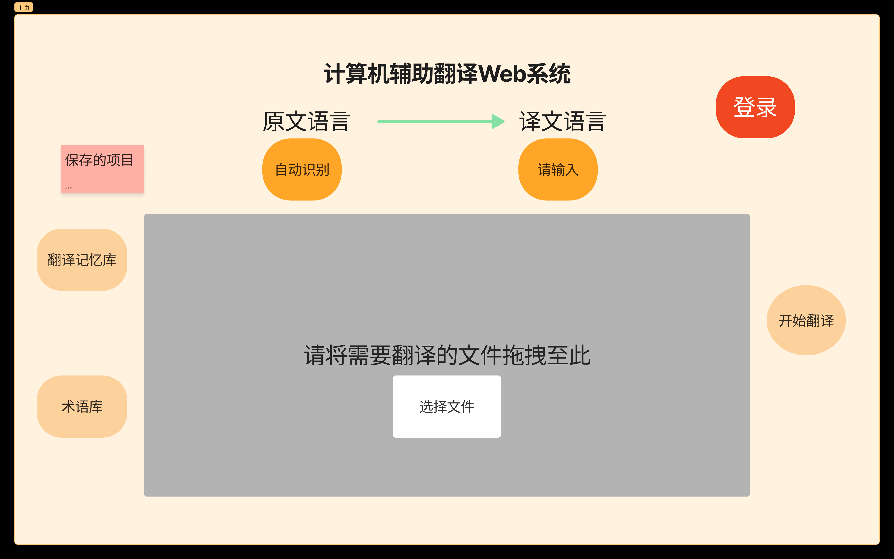
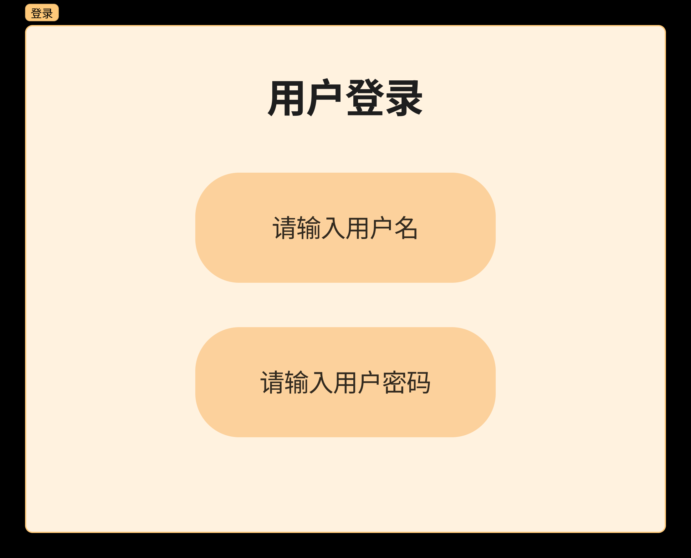
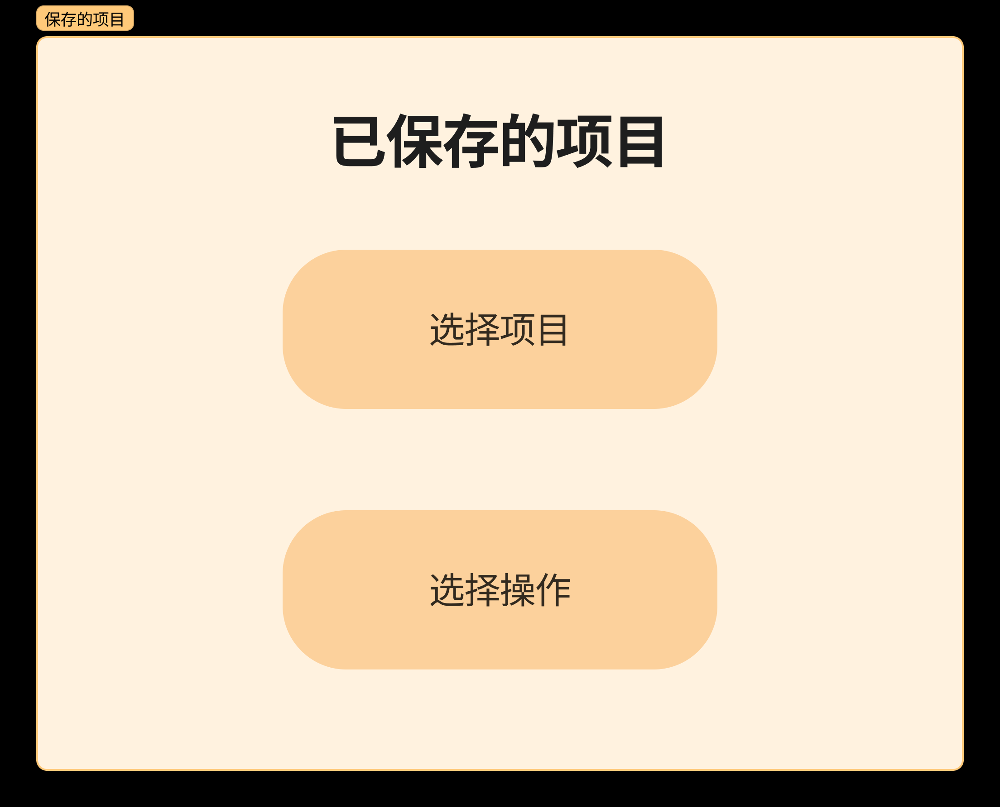
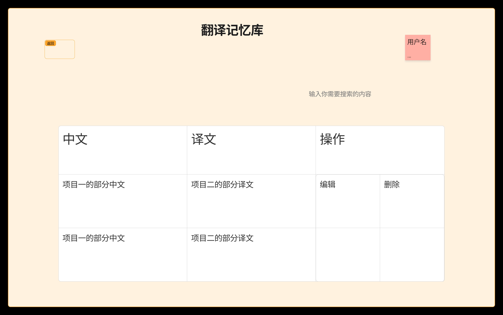
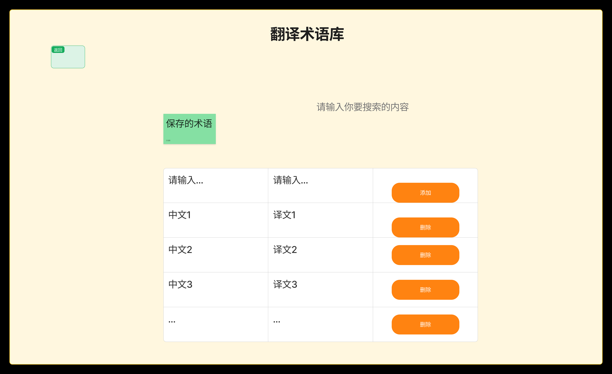
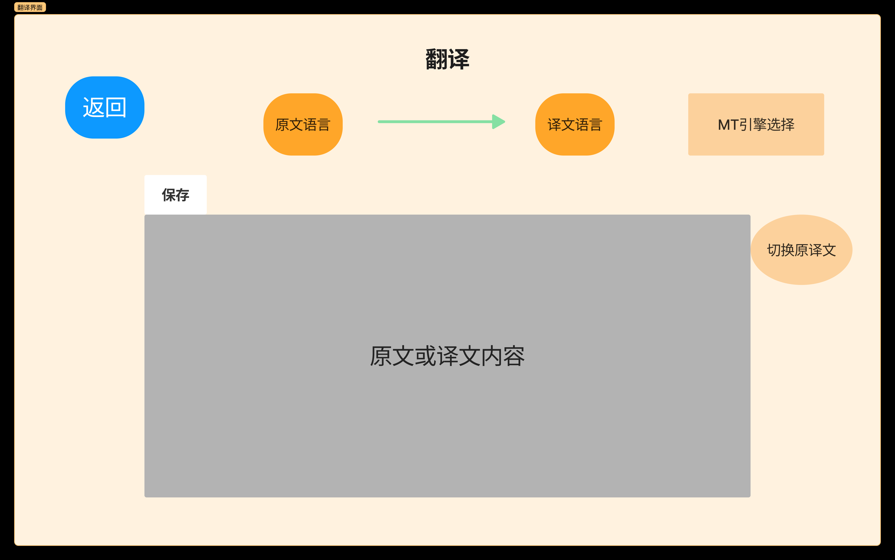

## README.md

本文件夹提供UI的设计原型

（现阶段UI界面设计为初稿，待后续继续优化！）

## 界面分析

### 1.主界面

#### 界面交互分析：

1. 用户可以点击“登录”来登录自己账号进行操作

   

2. 用户可以自主拖动文件创建翻译项目，同时也可以点击选择“选择文件”按钮选择文件创建翻译项目

3. 保存的项目栏，用户可以看到之前创建的翻译项目，在项目的操作栏点击“选择操作”可以对项目进行打开、修改和更新等操作。

   

4. 创建完翻译项目后，系统自主识别原文语言，同时用户可以在“译文语言“处自主选择目标语言

5. 用户可以点击“开始翻译”来进行翻译项目的翻译工作

6. 用户可以点击“进入翻译记忆库”进去翻译记忆库来进行所需操作

7. 用户可以点击“进入术语库”进去术语库来进行所需操作

### 2.翻译记忆库界面

#### 界面交互分析：

1. 用户点击“返回”按钮返回主界面。
2. 用户可以在搜索栏输入关键字来进行所寻找翻译项目的检索。
3. 用户在“操作”栏可以选择对翻译记忆库的条目进行编译或者删除操作。

### 3.术语库界面

#### 界面交互分析：

1. 用户点击“返回”按钮返回主界面。

2. 用户可以在搜索栏输入关键字来进行所寻找术语的检索。

3. 用户可以点击“添加”按钮来进行新术语的创建。

4. 用户可以点击“删除”按钮对保存的术语进行删除操作

### 4.翻译界面

#### 界面交互分析：

1. 用户点击“返回”按钮返回主界面。

2. 用户可以在“语言类型切换”栏选择目标语言便于系统对原文的自动翻译。

3. 用户可以在“MT引擎选择”栏来自主选择翻译引擎。

4. 用户在翻译过程中可以随时点击“保存”来进行翻译进度的保存。

5. 用户可以点击“切换原译文“来进行原文和译文的切换
